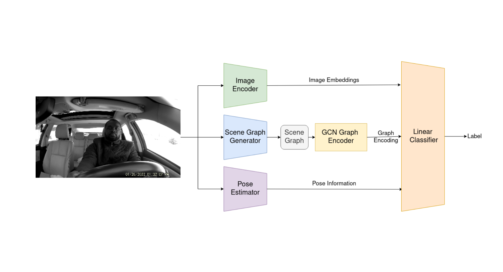

# KiD3-Knowledge-Infused-Distracted-Driving-Detection
This repository implements KiD3 introduced in the paper **Towards Infusing Auxiliary Knowledge for Distracted Driver
Detection** which was accepted by KiL'24: Workshop on Knowledge-infused Learning co-located with 30th ACM KDD Conference,
August 26, 2024, Barcelona, Spain


## Introduction

This repository presents the implementation of KiD3, a novel method for distracted driver detection (DDD) by infusing auxiliary knowledge about semantic relations between entities in a scene and the structural configuration of the driver's pose. Specifically, a unified framework that integrates the scene graphs, and driver's pose information with the visual cues in video frames to create a holistic representation of the driver's actions.



## Getting Started

### Prerequisites

1. Clone the [RelTR repository](https://github.com/yrcong/RelTR/tree/main) into the RelTR folder of this repository and replace the inference.py file with the one provided in the RelTR folder of this repository. Make sure to follow the installation instructions provided in the RelTR repository (including downloading the pre-trained models).

2. Similarly, clone the [OpenPose repository](https://github.com/Hzzone/pytorch-openpose) into the OpenPose folder of this repository and add the openpose.py file provided in the OpenPose folder of this repository. Make sure to follow the installation instructions provided in the OpenPose repository (including downloading the pre-trained models).

### Data Preparation

1. Download the SynDD1 dataset and annotate every frame with the corresponding driver's action label and save the fames in `'{user_id}_{minute}_{second}_{label}.jpg'` format. Do this for all videos in the dataset and save then in the Datasets/AnnotatedVideos/{video_name} folder.

2. Extract the scene graphs for each frame by running `Preprocessing/scene_graph.py`

3. Extract the driver's pose information for each frame by running `OpenPose/openpose.py`

4. Extract the object features for each frame by running `Preprocessing/yolo_objects.py`

5. Constuct the peripheral information for each frame by running `Preprocessing/distances.py`

6. Get the image embeddings for each frame by running `Preprocessing/image_embeddings.py`. Download the pretrained model from [here](https://drive.google.com/file/d/1Xdn93qDHJk8fdeNM3AGU76NHEkD4cBRj/view?usp=sharing)

### Training and Evaluation

Run experiments by running `experiments.py`. The results will be displayed in the console.

## Citation

If you find this repository useful in your research, please consider citing the following paper:

```bibtex
@inproceedings{kiD3,
  title={Towards Infusing Auxiliary Knowledge for Distracted Driver Detection},
  author={Ishwar B Balappanawar and Ashmit Chamoli and Ruwan Wickramarachchi and Aditya Mishra and Ponnurangam Kumaraguru and Amit P. Sheth},
  booktitle={KiL'24: Workshop on Knowledge-infused Learning co-located with 30th ACM KDD Conference},
  year={2024},
  organization={ACM},
  url={https://openreview.net/forum?id=WQdNGavZu3}
}
```
